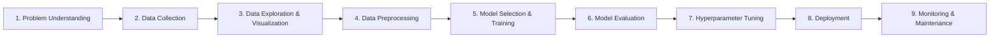

# Chapter 1: The Machine Learning Landscape

## 📖 Apa itu Machine Learning?

Machine Learning (ML) adalah **ilmu dan seni memprogram komputer agar bisa belajar dari data tanpa harus diprogram secara eksplisit**. Berbeda dengan pemrograman tradisional yang memerlukan aturan manual, ML memungkinkan sistem belajar dari pengalaman untuk meningkatkan performa.

> **Definisi Klasik oleh Tom Mitchell:**
> 
> *"A computer program is said to learn from experience E with respect to some task T and some performance measure P, if its performance on T, as measured by P, improves with experience E."*

### 🔍 Contoh Sederhana
**Filter Spam Email** - Sistem belajar dari contoh email spam dan bukan spam untuk mengenali email baru secara otomatis.

## 🎯 Mengapa Machine Learning Penting?

| **Alasan** | **Penjelasan** |
|------------|----------------|
| **Kompleksitas Masalah** | Beberapa masalah terlalu kompleks untuk dipecahkan dengan algoritma tradisional |
| **Adaptabilitas** | Sistem dapat beradaptasi dengan perubahan lingkungan |
| **Otomatisasi** | Mengurangi kebutuhan programming manual untuk setiap kasus |
| **Skalabilitas** | Dapat menangani volume data yang besar |

### 📈 Contoh Aplikasi Nyata
- 🗣️ **Pengenalan Suara** - Dalam berbagai bahasa dan lingkungan bising
- 📧 **Filter Spam** - Digunakan sejak 1990-an
- 📝 **OCR (Optical Character Recognition)** - Membaca teks dari gambar
- 🏠 **Prediksi Harga Properti** - Seperti proyek perumahan California

## 🔬 Jenis-Jenis Pembelajaran Machine Learning

### 1. **Supervised Learning** 🎯
**Data berlabel** - Model belajar dari input-output pairs
- **Klasifikasi**: Email spam/tidak spam
- **Regresi**: Prediksi harga rumah

### 2. **Unsupervised Learning** 🔍
**Data tanpa label** - Model mencari pola tersembunyi
- **Clustering**: Mengelompokkan pelanggan
- **Association Rules**: "Orang yang membeli X juga membeli Y"

### 3. **Online Learning** 🔄
**Pembelajaran berkelanjutan** - Model update seiring data baru masuk
- Real-time adaptation
- Memory-efficient untuk big data

### 4. **Instance-based vs Model-based Learning** 🏗️
- **Instance-based**: Menyimpan contoh, prediksi berdasarkan kemiripan
- **Model-based**: Membangun model matematis dari data training

## ⚠️ Tantangan Utama dalam Machine Learning

### 🗂️ **Masalah Data**
| Tantangan | Deskripsi | Solusi |
|-----------|-----------|---------|
| **Bad Data** | Data kotor, tidak konsisten | Data cleaning & preprocessing |
| **Insufficient Data** | Jumlah data terlalu sedikit | Data augmentation, transfer learning |
| **Nonrepresentative Data** | Sample bias | Stratified sampling |
| **Poor-Quality Features** | Fitur tidak relevan | Feature engineering & selection |

### 🎯 **Masalah Model**
- **Overfitting**: Model terlalu spesifik pada training data
- **Underfitting**: Model terlalu sederhana untuk menangkap pola

## 🛠️ Workflow Proyek Machine Learning

### 📋 Tahapan Detail:
1. **Problem Understanding** - Definisikan tujuan bisnis
2. **Data Collection** - Kumpulkan data yang relevan
3. **Data Exploration** - Analisis dan visualisasi data
4. **Data Preprocessing** - Cleaning, transformation, feature engineering
5. **Model Selection** - Pilih algoritma yang sesuai
6. **Training** - Latih model dengan training data
7. **Evaluation** - Test performa dengan validation data
8. **Hyperparameter Tuning** - Optimasi parameter model
9. **Deployment** - Deploy ke production environment

## 💡 Konsep Penting yang Harus Dipahami

### 🔑 **Terminologi Dasar**
- **Model**: Representasi matematis dari solusi masalah
- **Training Set**: Data untuk melatih model
- **Test Set**: Data untuk evaluasi performa model
- **Features**: Input variables yang digunakan model
- **Target**: Output yang ingin diprediksi

### 📊 **Metrik Evaluasi**
- **Accuracy**: Proporsi prediksi yang benar
- **Precision**: Proporsi positive predictions yang benar
- **Recall**: Proporsi actual positives yang terdeteksi
- **F1-Score**: Harmonic mean dari precision dan recall

## 🎓 Key Takeaways

> **"Machine Learning bukan solusi ajaib"** 
> 
> Kesuksesan ML sangat bergantung pada:
> - ✅ **Kualitas data** yang baik
> - ✅ **Pemilihan algoritma** yang tepat  
> - ✅ **Pemahaman domain** masalah
> - ✅ **Evaluasi** yang komprehensif

### 🔬 **Pentingnya Memahami Dasar ML**
Meskipun beberapa aplikasi ML bisa dibuat tanpa mengerti detail teknis, **memahami konsep dasar sangat membantu** dalam:
- Memilih model dan algoritma yang sesuai
- Menyetel hyperparameter dengan optimal
- Mendiagnosis dan memperbaiki masalah model
- Membuat keputusan yang informed tentang trade-off

---

## 📚 Referensi & Bacaan Lanjutan

- **Hands-On Machine Learning** by Aurélien Géron
- **The Elements of Statistical Learning** by Hastie, Tibshirani & Friedman
- **Pattern Recognition and Machine Learning** by Christopher Bishop

---

**Happy Learning! 🚀**

*"The best way to learn machine learning is by doing machine learning."*

